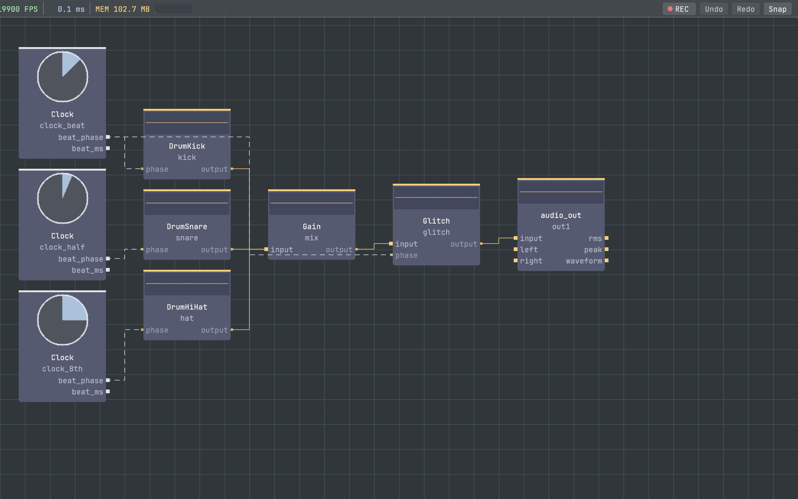

# vivid-glitch

`vivid-glitch` is a package library of creative audio and visual glitch effects for Vivid. It covers beat-aware audio destruction, video corruption, and meta-effects that recombine those building blocks.

## Preview



## Package docs model

- this `README.md` is the package overview used by the central Vivid docs site
- operator reference pages are generated from source doc block comments in `operators/`
- package graphs under `graphs/` are the active smoke and demo surface

## Audio operators

- `Stutter`
- `TapeStop`
- `BeatRepeat`
- `Reverse`
- `Scratch`
- `Stretch`
- `FreqShift`
- `Glitch`

## Visual operators

- `JPEG Glitch`
- `Pixel Sort`
- `Block Displacement`
- `Scan Distort`
- `Channel Shift`
- `VHS`
- `Static Glitch`
- `Datamosh`
- `Visual Glitch`

## Install

```bash
./build/vivid install https://github.com/seethroughlab/vivid-glitch.git
```

## Local development

From vivid-core:

```bash
./build/vivid link ../vivid-glitch
./build/vivid rebuild vivid-glitch
```

## Example usage

Use the package demo graphs as the current reference surface:

- `graphs/glitch_demo.json` — visual glitch chain overview
- `graphs/av_glitch_demo.json` — combined audio and visual glitch workflow

For beat-aware audio workflows, route a current audio-world beat source such as `clock_au/beat_phase` into the glitch operator's `phase` input.

## Notes

- GPU operators live under `gpu_operators` in `vivid-package.json`.
- The package is designed as a modular fixed-cadence surface; package docs should prefer current core operator names and current install commands.

## Validation

Before pushing changes:

1. Configure and build the package operators.
2. Run package tests.
3. Validate the link/rebuild cycle from vivid-core.
4. Run `test_demo_graphs` against this package's `graphs/` directory.
5. Treat graph smoke as load and coverage validation; GPU-heavy graphs may skip in headless CI.

## License

MIT.
